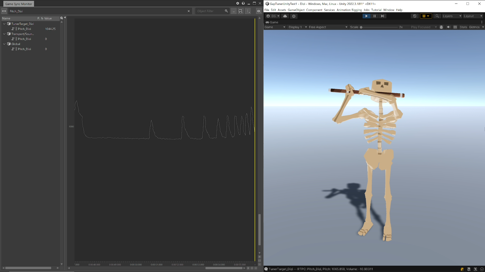
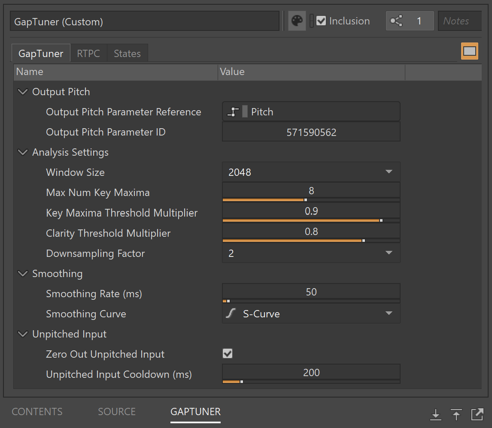

# GapTuner

<a href="https://youtu.be/vSNP8Qiqbjc">
	
	 
	Demo video
</a>

## Overview

GapTuner is a real-time monophonic pitch tracker implemented as a Wwise effect plugin.

The plugin's source code serves as accompaniment to Chapter 9 ([Building a Pitch Tracker: Fundamentals](https://www.taylorfrancis.com/chapters/edit/10.1201/9781003330936-11/building-pitch-tracker-david-su)) and Chapter 10 ([Building a Pitch Tracker: Practical Techniques](https://www.taylorfrancis.com/chapters/edit/10.1201/9781003330936-12/building-pitch-tracker-david-su)) of [Game Audio Programming 4: Principles and Practices](https://www.routledge.com/Game-Audio-Programming-4-Principles-and-Practices/Somberg/p/book/9781032361079).

If you're interested in seeing some of these pitch tracking concepts in action, check out [One Hand Clapping](https://handy-games.com/en/games/one-hand-clapping/), a game in which the player sings into the microphone to solve musical puzzles!

## Usage

Add a GapTuner instance in your effects chain and set the **Output Pitch Parameter Reference** to an RTPC of your choice. The RTPC value will now track the pitch of incoming audio to the plugin:

The plugin consists of four categories of parameters:
1. **Output Pitch**
	- **Output Pitch Parameter Reference:** A reference to the output pitch RTPC. This allows you to browse to a specific RTPC in your project within Wwise authoring.
	- **Output Pitch Parameter ID:** The ID of the output pitch RTPC. This gets populated automatically when you set the Output Pitch Parameter Reference, but you can also set this manually if you'd like.
2. **Analysis Settings**
	- **Window Size:** The size (in samples) of the analysis window to use for pitch detection. Larger windows allow better detection of lower frequencies but incur more latency and CPU usage.
	- **Max Num Key Maxima:** Maximum number of key maxima to consider during the peak picking process. Higher values allow for more accuracy but require slightly more CPU usage.
	- **Key Maxima Threshold Multiplier:** Multiplier that determines the correlation threshold above which key maxima can be picked. Higher values bias towards higher octave errors, while lower values bias towards lower octave errors.
	- **Clarity Threshold Multiplier:** Multiplier that determines the correlation threshold above which the pitch estimate has sufficient clarity. Higher values result in greater robustness to noise at the cost of reduced overall sensitivity.
	- **Downsampling Factor:** Factor by which the window size gets downsampled prior to performing analysis. Higher values result in lower CPU usage at the cost of reduced accuracy and precision.
3. **Smoothing**
	- **Smoothing Rate (ms):** Interpolation rate for setting the output pitch parameter value. Higher values result in increased responsiveness at the cost of decreased smoothness.
	- **Smoothing Curve:** Curve to use for interpolating the output pitch parameter value.
5. **Unpitched Input**
	- **Zero Out Unpitched Input:** Whether to set the output pitch value to 0 when unpitched input is detected. Useful for scenarios where input frequently switches between pitched and unpitched (e.g. vocalized notes with breaths in between).
	- **Unpitched Input Cooldown (ms):** How long unpitched input must be sustained before the output pitch value gets set to 0. Only applies if Zero Out Unpitched Input is set to true.

## Installation

### Step 1: Download/build plugin binaries

#### Option A: Download

You can download pre-compiled binaries from the [releases page](https://github.com/usdivad/GapTuner/releases). These include binaries for the Authoring and Windows platforms, for Wwise versions 2022.1, 2023.1, and 2024.1. For other platforms or Wwise versions, see Option B below.

#### Option B: Build

The following instructions are for the Authoring platform with the [vc170 toolset](https://www.audiokinetic.com/en/library/edge/?source=SDK&id=reference_platform.html) (i.e. Visual Studio 2022, toolset vc143) -- for information on building and packaging for various platforms, see the Wwise documentation on [building](https://www.audiokinetic.com/en/library/edge/?source=SDK&id=effectplugin_tools_building.html) and [packaging](https://www.audiokinetic.com/en/library/edge/?source=SDK&id=effectplugin_tools_packaging.html) effect plugins.

1. Download [RapidJSON](https://github.com/Tencent/rapidjson) and place the `include` directory in `Libraries/rapidjson` (so that you should have a `Libraries/rapidjson/include/rapidjson` directory)
2. Premake: `python "%WWISEROOT%\Scripts\Build\Plugins\wp.py" premake Authoring`
3. Open GapTuner_Authoring_Windows_vc170.sln and apply project settings:
	- Retarget both GapTuner and GapTunerFX projects to the latest Windows SDK version (e.g. 10.0) if necessary
	- (optional) To enable debugging via attaching to Wwise Authoring, set: Properties > C/C++ > Optimization > `Disabled (/Od)`
5. Build: `python "%WWISEROOT%/Scripts/Build/Plugins/wp.py" build Authoring -c Release -x x64 -t vc170` (or directly via Visual Studio)

### Step 2: Install via the Audiokinetic Launcher

1. Navigate to the **Plug-Ins** tab
2. Under **Install New Plug-Ins**, select **Add from directory**
3. Select the directory that contains the plugin binaries from Step 1
4. Under **Choose Plug-Ins**, select GapTuner (it may already be auto-selected)
5. Press **Install**

After the installation completes, once you navigate to the **Plug-Ins** tab you should see GapTuner under **Installed Plug-Ins**:

## Licensing

This work is licensed under the [MIT License](LICENSE), except for Wwise plugin scaffolding portions, which are licensed under [Apache 2.0](http://www.apache.org/licenses/LICENSE-2.0).

## Contact
Please [get in touch](hello@usdivad.com) if you end up making any cool stuff using this, as well as if you have any questions, comments, or suggestions!
``